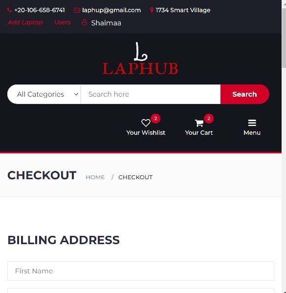
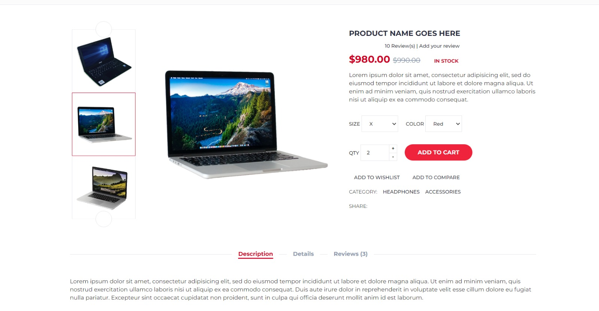

# LapHuB

LapHuB is an e-Commerce web application developed using Servlet and JSP technologies for online shopping. The application is built with a user-friendly interface using JavaScript and AJAX to provide an enhanced user experience. JPA is integrated as an ORM tool for managing data in the MySQL database, ensuring efficient data retrieval and storage. The web app also includes an admin dashboard to enable efficient website management.

## Installation
1. Clone the repository to your local machine.
2. Import the project into your preferred IDE.
3. Create a MySQL database and update the persistence.xml file with the appropriate credentials.
4. Build the project and deploy it on Apache Tomcat.
5. Access the web application through the web browser using the appropriate URL.

## Technologies
- Servlets and JSP.
- JavaScript and AJAX.
- JPA.
- MySQL.
- Bootstrap.

## Features
- User authentication and registration.
- User profile management.
- Product details page.
- Shopping cart and checkout functionality.
- Order history and tracking.
- Admin dashboard for managing products, orders, and users.

## Team members
- [Shaimaa Hassan](https://github.com/ShaimaaHassan3)
- [Ahmed Sultan](https://github.com/Ahmedhsultan)
- [Ahmed Mohamed](https://github.com/a7med-m7md)

## Screenshots
- 
- 
